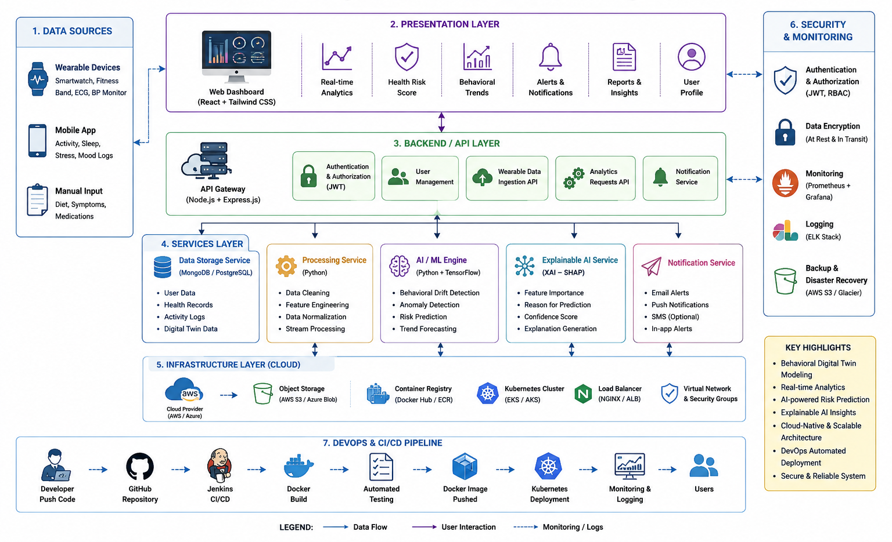

# NeuroSync AI
Behavioral Digital Twin for Predictive Health Monitoring

## Overview
NeuroSync AI is a cloud-native predictive healthcare platform that creates behavioral digital twins using wearable and lifestyle data to identify abnormal behavioral drift and generate explainable health-risk predictions.

## Features
- Data preprocessing
- Model training
- Prediction system
- Performance evaluation
- Result visualization

## Technologies Used
- Python
- Machine Learning
- Pandas
- NumPy
- Scikit-learn
- Matplotlib

## Architecture Diagram



## Project Structure
```bash
src/            -> Source code
dataset/        -> Dataset files
models/         -> Saved models
results/        -> Output results
screenshots/    -> Project screenshots
report/         -> Documentation/report
```

## Installation

```bash
pip install -r requirements.txt
```

## Run the Project

## Author
Sen Sabu
Lovely Professional University

```bash
python main.py
```

## Author
Sen Sabu
